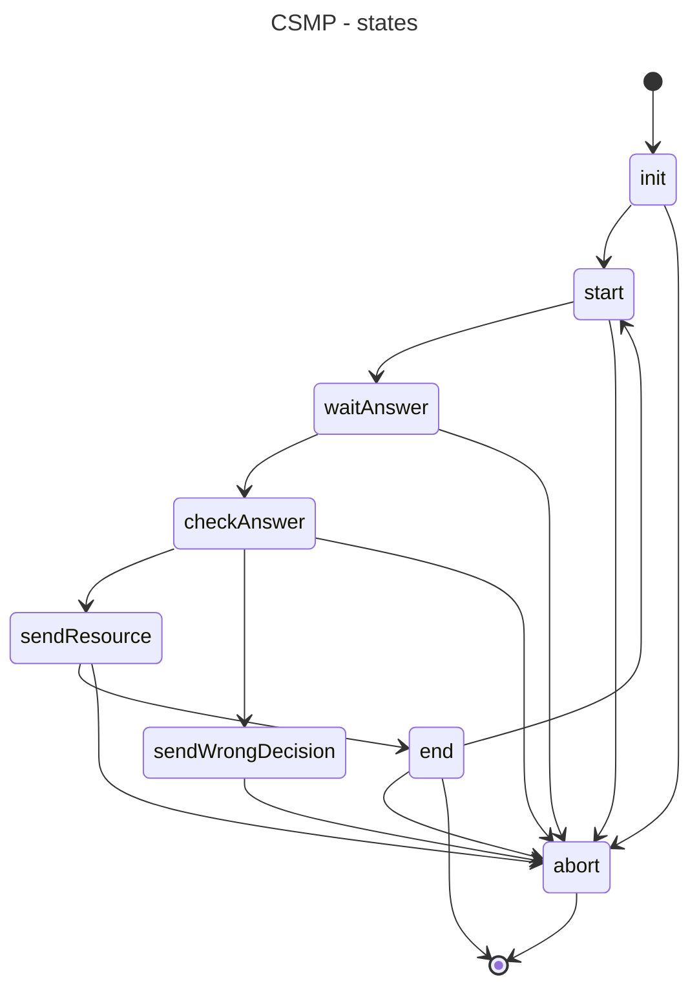

# Instructions for running the server and client with Docker

## Compose

# Run the client container
``` bash
docker compose -f docker/compose.yaml -p pow up --abort-on-container-exit --force-recreate --build

```

# Build&Run Docker images

## Build for server
``` bash
docker build -t myserver:latest -f ./docker/server/Dockerfile .
```

## Build for client
``` bash
docker build -t myclient:latest -f ./docker/client/Dockerfile .
```

## Run the server container

``` bash
docker run --rm --name server-container -p 3333:3333 myserver:latest -port 3333
```

## Run the client container

``` bash
docker run --rm --name client-container --link server-container myclient:latest -server 'server-container:3333'
```

# Simple small doc:
## About POW

I decided to take the simplest and most banal pow: find a hash that starts with zeros.
It's easy and simple.

However, I also thought about asking the client to find a private key whose public key starts with the characters. (petre, anna etc)

I encountered a similar problem when I was setting up wiregruard. and this code solves it perfectly.
https://github.com/axllent/wireguard-vanity-keygen/tree/develop
``` shell
$ wireguard-vanity-keygen -l 3 test pc1/ "^pc7[+/]"
Calculating speed: 49,950 calculations per second using 4 CPU cores
Case-insensitive search, exiting after 4 results
Probability for "test": 1 in 2,085,136 (approx 41 seconds per match)
Probability for "pc1/": 1 in 5,914,624 (approx 1 minute per match)
Cannot calculate probability for the regular expression "^pc7[/+]"

Press Ctrl-c to cancel

private OFVUjUoTNQp94fNPB9GCLzxiJPTbN03rcDPrVd12uFc=   public tEstMXL/3ZzAd2TnVlr1BNs/+eOnKzSHpGUnjspk3kc=
private gInIEDmENYbyuaWR1W/KLfximExwbcCg45W2WOmEc0I=   public TestKmA/XVagDW/JsHBXk5mhYJ6E1N1lAWeIeCttgRs=
private yDQLNiQlfnMGhUBsbLQjoBbuNezyHug31Qa1Ht6cgkw=   public PC1/3oUId241TLYImJLUObR8NNxz4HXzG4z+EazfWxY=
```

But in the process I focused more on writing good extensible and modifiable code. rather than on a complex POW implementation.


## Сustom protocoll over tcp
CSMP - custom simple message protocol

I thought about adding the protocol version to the task type communication channel. But I decided not to overengineering it.

This is a connection state diagram from the server's perspective

